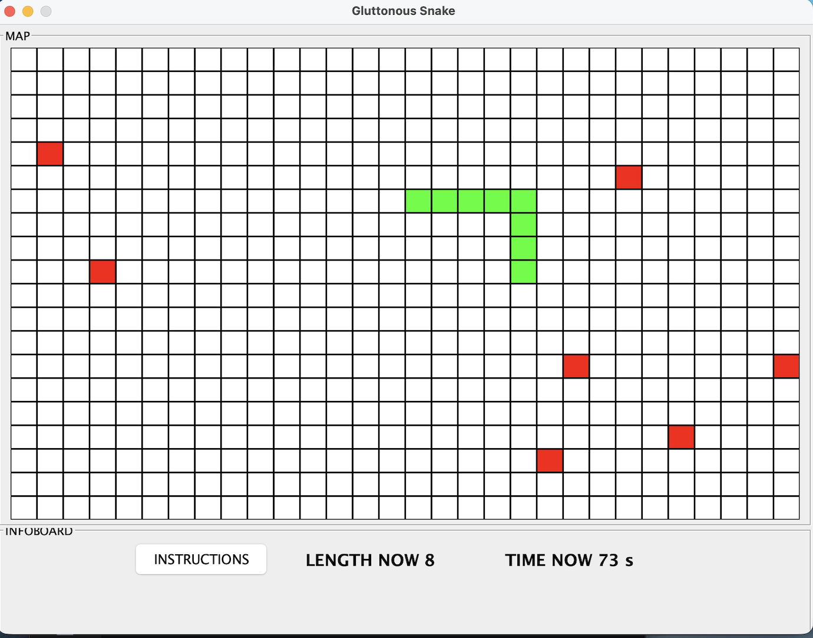

# Gluttonous Snake

一个基于持续移动、相对转向、吃苹果、成长、计时与碰撞检测的 Java 桌面贪吃蛇游戏。

[English](README.md)

## 项目概述

项目实现了完整的小型游戏循环：蛇持续移动，苹果随机生成，界面显示长度和时间，并在越界或撞到自身时结束。与逐步操作的网格游戏不同，玩家必须使用 A/D 实时控制左右转向。

## 截图



截图直接来自运行中的 Java 应用。

## 功能

- 持续移动
- A/D 相对转向
- 苹果生成、增长与颜色变化
- 长度与用时显示
- 边界和自身碰撞检测

## 运行

仓库中的 JAR 已在 Java 25 上验证：

```bash
java -jar Gluttonous-Snake.jar
```

## 当前限制

- 暂无确定性随机种子和自动化测试。
